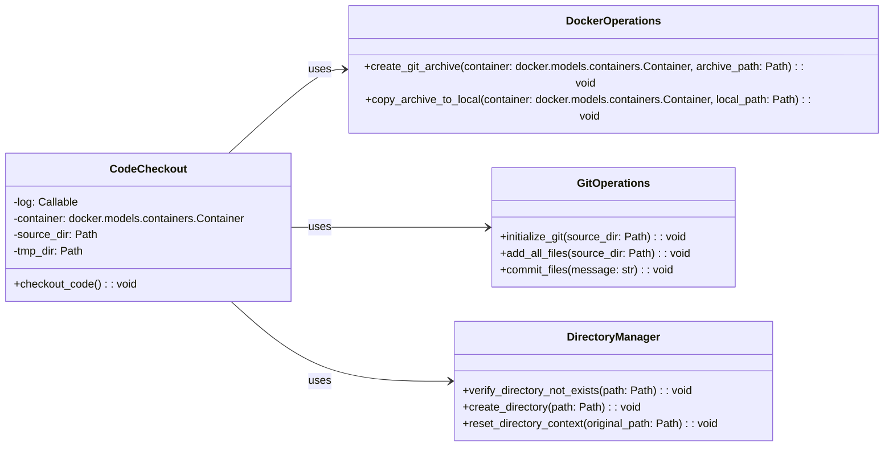

```mermaid
classDiagram
  direction LR

  class CodeCheckout {
      -log: Callable
      -container: docker.models.containers.Container
      -source_dir: Path
      -tmp_dir: Path
      +checkout_code(): void
  }

  class GitOperations {
      +initialize_git(source_dir: Path): void
      +add_all_files(source_dir: Path): void
      +commit_files(message: str): void
  }

  class DockerOperations {
      +create_git_archive(container: docker.models.containers.Container, archive_path: Path): void
      +copy_archive_to_local(container: docker.models.containers.Container, local_path: Path): void
  }

  class DirectoryManager {
      +verify_directory_not_exists(path: Path): void
      +create_directory(path: Path): void
      +reset_directory_context(original_path: Path): void
  }

  CodeCheckout --> DockerOperations : uses
  CodeCheckout --> GitOperations : uses
  CodeCheckout --> DirectoryManager : uses
```
