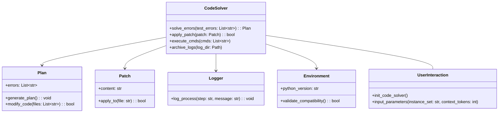

```mermaid
classDiagram

class CodeSolver {
  +solve_errors(test_errors: List~str~): Plan
  +apply_patch(patch: Patch): bool
  +execute_cmds(cmds: List~str~)
  +archive_logs(log_dir: Path)
}

class Plan {
  +errors: List~str~
  +generate_plan(): void
  +modify_code(files: List~str~): bool
}

class Patch {
  +content: str
  +apply_to(file: str): bool
}

class Logger {
  +log_process(step: str, message: str): void
}

class Environment {
  +python_version: str
  +validate_compatibility(): bool
}

class UserInteraction {
  +init_code_solver()
  +input_parameters(instance_set: str, context_tokens: int)
}

CodeSolver --> Plan
CodeSolver --> Patch
CodeSolver --> Logger
CodeSolver --> Environment
CodeSolver -- UserInteraction
```
