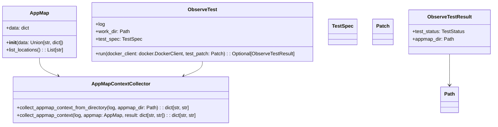

```mermaid
classDiagram
    class AppMap {
        +data: dict
        +__init__(data: Union[str, dict])
        +list_locations(): List[str]
    }
    class ObserveTest {
        +log
        +work_dir: Path
        +test_spec: TestSpec
        +run(docker_client: docker.DockerClient, test_patch: Patch): Optional[ObserveTestResult]
    }
    class Path {
    }
    class TestSpec {
    }
    class Patch {
    }
    class ObserveTestResult {
        +test_status: TestStatus
        +appmap_dir: Path
    }
    class AppMapContextCollector {
        +collect_appmap_context_from_directory(log, appmap_dir: Path): dict[str, str]
        +collect_appmap_context(log, appmap: AppMap, result: dict[str, str]): dict[str, str]
    }
    AppMap --> AppMapContextCollector
    ObserveTest --> AppMapContextCollector
    ObserveTestResult --> Path
```
