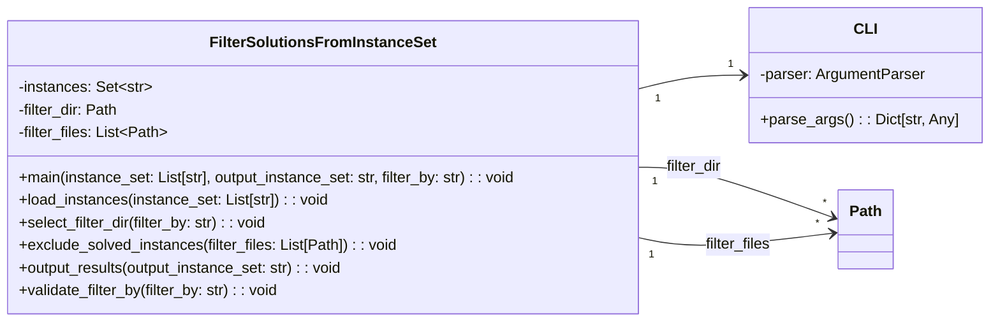

```mermaid
classDiagram
    direction LR

    class FilterSolutionsFromInstanceSet {
        -instances: Set~str~
        -filter_dir: Path
        -filter_files: List~Path~
        +main(instance_set: List[str], output_instance_set: str, filter_by: str): void
        +load_instances(instance_set: List[str]): void
        +select_filter_dir(filter_by: str): void
        +exclude_solved_instances(filter_files: List[Path]): void
        +output_results(output_instance_set: str): void
        +validate_filter_by(filter_by: str): void
    }

    class CLI {
        -parser: ArgumentParser
        +parse_args(): Dict[str, Any]
    }

    FilterSolutionsFromInstanceSet "1" --> "1" CLI
    FilterSolutionsFromInstanceSet "1" --> "*" Path : filter_dir
    FilterSolutionsFromInstanceSet "1" --> "*" Path : filter_files
```
