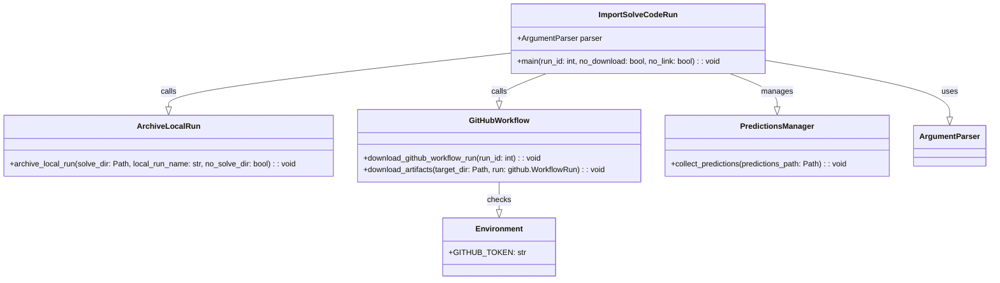

```mermaid
classDiagram

class ImportSolveCodeRun {
    +ArgumentParser parser
    +main(run_id: int, no_download: bool, no_link: bool): void
}

class ArchiveLocalRun {
    +archive_local_run(solve_dir: Path, local_run_name: str, no_solve_dir: bool): void
}

class GitHubWorkflow {
    +download_github_workflow_run(run_id: int): void
    +download_artifacts(target_dir: Path, run: github.WorkflowRun): void
}

class PredictionsManager {
    +collect_predictions(predictions_path: Path): void
}

class Environment {
    +GITHUB_TOKEN: str
}

ImportSolveCodeRun --|> ArgumentParser : uses
ImportSolveCodeRun --|> GitHubWorkflow : calls
ImportSolveCodeRun --|> ArchiveLocalRun : calls
ImportSolveCodeRun --|> PredictionsManager : manages
GitHubWorkflow --|> Environment : checks
```
