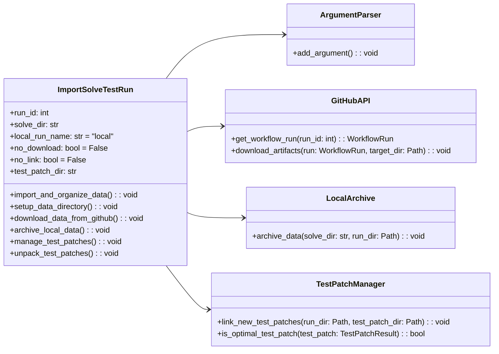

```mermaid
classDiagram
    direction LR

    class ImportSolveTestRun {
        +run_id: int
        +solve_dir: str
        +local_run_name: str = "local"
        +no_download: bool = False
        +no_link: bool = False
        +test_patch_dir: str

        +import_and_organize_data(): void
        +setup_data_directory(): void
        +download_data_from_github(): void
        +archive_local_data(): void
        +manage_test_patches(): void
        +unpack_test_patches(): void
    }

    class ArgumentParser {
        +add_argument(): void
    }

    class GitHubAPI {
        +get_workflow_run(run_id: int): WorkflowRun
        +download_artifacts(run: WorkflowRun, target_dir: Path): void
    }

    class LocalArchive {
        +archive_data(solve_dir: str, run_dir: Path): void
    }

    class TestPatchManager {
        +link_new_test_patches(run_dir: Path, test_patch_dir: Path): void
        +is_optimal_test_patch(test_patch: TestPatchResult): bool
    }

    ImportSolveTestRun --> ArgumentParser
    ImportSolveTestRun --> GitHubAPI
    ImportSolveTestRun --> LocalArchive
    ImportSolveTestRun --> TestPatchManager
```
