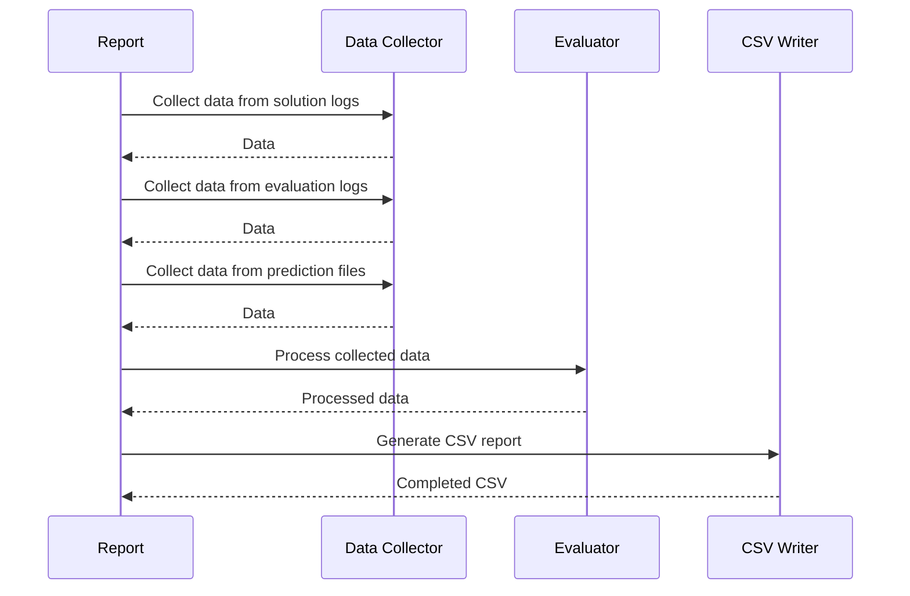

# Test Reporting Functionality

## Overview

The test reporting functionality within the `Report` class plays a crucial role in assessing the accuracy and performance of solver solutions. It achieves this by generating a comprehensive CSV report that consolidates data from three primary sources: evaluation results, solution logs, and prediction files.

## Initialization

The `Report` class is set up by specifying paths to the following directories:

- **Solution Logs Directory (`solve_data_dir`)**: This contains log files that document the results of solver operations, including detailed solution data.
- **Evaluation Logs Directory (`evaluation_logs_dir`)**: Optional directory for logs reflecting the evaluation process, including success metrics and problem resolution information.
- **Predictions Files Path (`predictions_path`)**: Points to files containing predicted outcomes for comparison against actual results.

## Core Functionality: Data Collection

1. **Solutions Data Collection**: The `generate` method of the `Report` class begins by traversing the solution logs directory to collect data pertaining to each solution instance. This data encapsulates key solution attributes and metrics.

2. **Predictions Data Collection**: Predictions are aggregated from specified files. Each prediction is associated with an `instance_id` which serves as a linking point between predictions, solutions, and evaluations.

3. **Evaluation Reports**: If the evaluation logs directory is provided, the method integrates evaluation data that includes applied patches, resolutions, and other essential metrics.

## Data Processing

- **Data Organization**: After data collection, the method organizes the data by `instance_id` to ensure cohesive reporting across different data sources.

- **Data Matching**: The functionality checks for the presence of corresponding entries across solutions and predictions, highlighting cases where some data might be missing and ensuring that identified matches are properly reported.

- **Verification and Completeness**: The method also verifies the completeness of data, alerting the user to any instance IDs that appear in some files but not others, a feature that aids debugging and data integrity assessments.

## Report Generation

- **CSV File Construction**: Utilizing a dictionary-based approach, the `generate` method constructs a CSV file which systematically presents the compiled data. This report is designed to be easy to read and analyze, offering insights into how well predictions matched the actual solutions and the effectiveness of applied evaluations.

- **Comprehensive Output**: The final output CSV includes all relevant fields from the solutions, predictions, and evaluations, ensuring users have a holistic view of the solver's performance and areas for improvement.

## Conclusion

The `Report` class is integral to the evaluation process, providing a structured mechanism to assess solver performance through detailed reporting. By leveraging this functionality, developers can make informed decisions regarding solver optimization and improvements, ultimately enhancing accuracy and performance.

## Diagram

