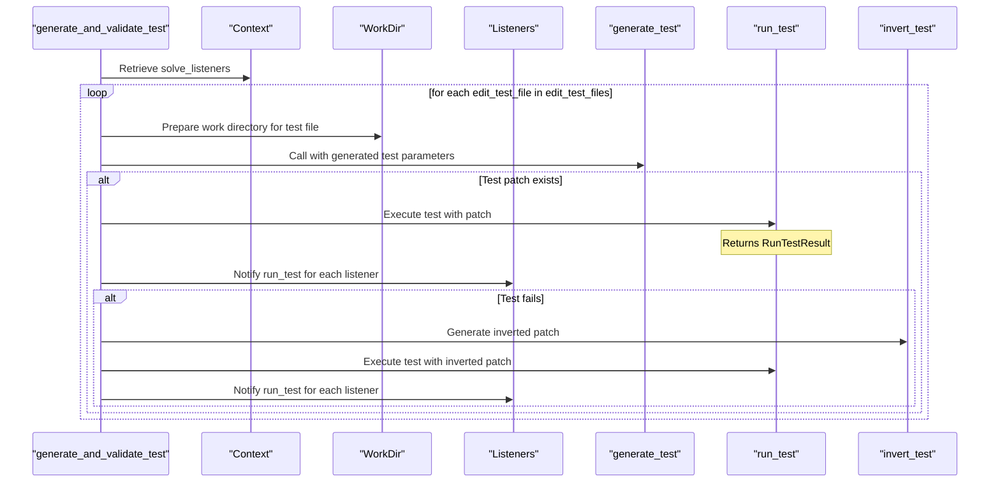

# Test Solver Architecture and Functionality

## Introduction

This document provides an overview of the architecture and functionality of the Test Solver, focusing on the `generate_and_validate_test` component. The Test Solver is a pivotal component of the system designed to automate the generation and validation of test patches to ensure software quality.

## Architecture Overview

### Key Components

1. **Generate and Validate Test**: 
   - Responsible for generating test patches and validating them within the system.
   - Integrates with Docker to run tests in isolated environments, offering a sandbox for evaluation.

2. **Solver Workflow**: 
   - Orchestrates the entire patch generation and validation process.
   - Manages interactions among various components like `WorkDir` and `CollectSolveListener`.

3. **Patch Application**: 
   - Patches are generated by leveraging functions like `generate_test_patch` and `validate_test_patch`.
   - Includes logic for creating inverted patches to test patches negatively, ensuring robustness and correctness.

4. **Listeners and Logging**: 
   - Solvers employ listeners to log events and changes during patch application.
   - `CollectSolveListener` is instrumental in capturing on_start and on_end events during patch operations.

### Functionality

- **Test Generation and Validation**:
  - The core function, `generate_and_validate_test`, formulates test patches and proceeds with validation to check adherence against predefined quality metrics.
  - Utilizes `ValidateTest` procedures to execute tests and gather results.
  
- **Integration with External Tools**:
  - Interacts with Docker to validate the test patches, ensuring testing occurs in clean, repeatable environments.
  
```python
# Sample interaction with Docker
docker_client = docker.from_env()
...
result = docker_client.containers.run('test-container', 'test_command')
```
  
- **Error Handling and Logging**: 
  - Implements logging through listeners to monitor patch generation and testing processes.
  - Errors or inconsistencies in patch application are captured and logged for diagnostics.

## Conclusion

The Test Solver provides a robust framework for testing patch generation and validation in codebases, ensuring adherence to quality expectations through a structured and systematic workflow. Its integration with Docker and listener-based logging enables efficient test management and debugging. This document serves as an introductory guide to understanding the main facets of the Test Solver's architecture and functionality.



