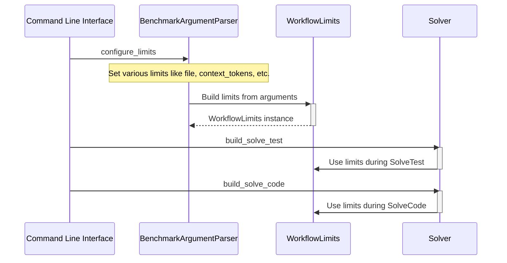

The `WorkflowLimits` architecture in the `navie-benchmark` project is designed to manage various execution constraints that can be applied during different stages of a workflow, particularly focusing on controlling the number of files and retry attempts in code generation and testing. Here’s a concise explanation of its architecture and utilization:

### Architecture of WorkflowLimits

The `WorkflowLimits` class encapsulates several attributes that define the permissible limits of workflow operations:

- **file_limit**: Maximum number of files that can be processed concurrently.
- **context_tokens_limit**: Maximum number of tokens allowed in the context.
- **test_files_limit**: Maximum number of test files that can be handled.
- **code_files_limit**: Limit on the number of code files.
- **test_lint_retry_limit**: Limit on retries for linting tests.
- **test_status_retry_limit**: Limit on retries for test status checks.
- **code_lint_retry_limit**: Limit on retries for linting code.
- **code_status_retry_limit**: Limit on retries for code status checks.
- **concurrency_limit**: Maximum concurrent workflows allowed.

### Application and Utilization

The WorkflowLimits are configured and applied primarily in the CLI and during the generation of code. Here’s how they integrate with the rest of the codebase:

1. **Configuration**: 
   - Limits are configured via command-line arguments parsed using `argparse`. 
   - The `configure_limits` function defines how limits can be set and parses them from command inputs (as seen in `solver/cli.py`).

2. **Application**:
   - `apply_limits` function is called with parsed arguments to set the limits. This function populates the `args.limits` dictionary with specified limits.

3. **Limit Object Creation**:
   - The `build_limits` function creates a `WorkflowLimits` object from a dictionary using the `from_dict` method. This method assigns values based on provided arguments or defaults.

4. **Utilization in Code Generation**:
   - For code generation processes like in `generate_code.py`, limits such as file limit act to control how many code changes can be applied at once. The process logs warnings if these limits are exceeded (seen in `generate_code.py`).

5. **Logging and Warnings**:
   - The workflow logs specific actions and warnings when limits are reached or exceeded, ensuring that developers are aware when their constraints are met.

By encapsulating constraints in the `WorkflowLimits` class, the system efficiently manages and enforces limits across workflows, enabling structured execution of tasks while respecting predefined thresholds.

## Example Usage

